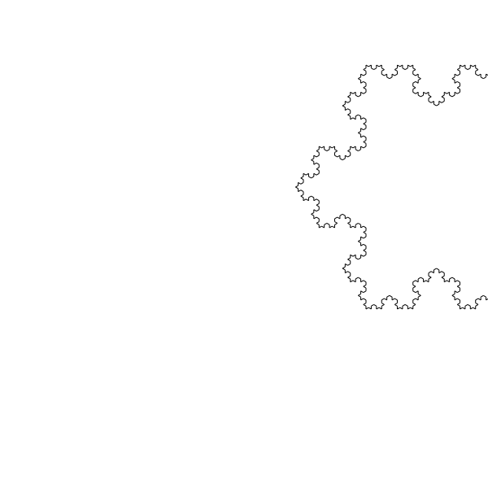
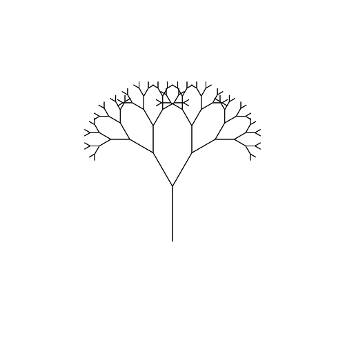
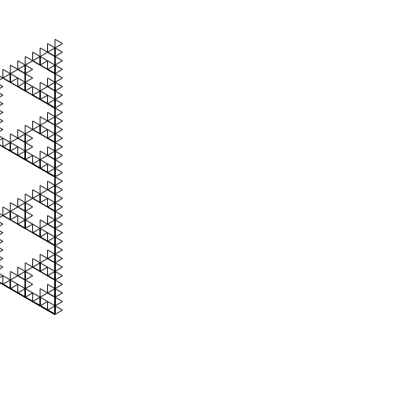
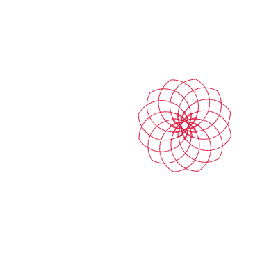
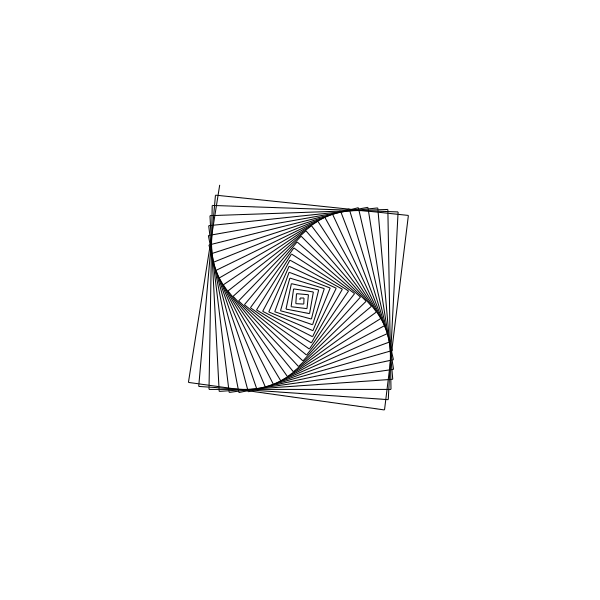
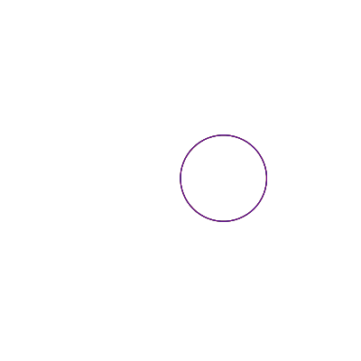

# 🐢 Turtle Graphics Language Interpreter

Common Lispで実装した教育用タートルグラフィックス言語インタプリタです。Logo言語に触発された構文で、再帰的なフラクタル図形からシンプルな幾何学模様まで描画できます。


## 🎨 サンプル出力

| コッホ雪片 | 二分木 | シェルピンスキー三角形 |
|:---:|:---:|:---:|
|  |  |  |

| 花模様 | 渦巻き | カラーホイール |
|:---:|:---:|:---:|
|  |  |  |

## ✨ 特徴

- **完全なLogo風構文**: `forward`, `right`, `repeat`, `to...end` など馴染みのある構文
- **算術演算**: `360 / :sides` のような式が使用可能
- **再帰**: フラクタル図形の描画に対応
- **条件分岐**: `if`, `ifelse` による分岐処理
- **ループ**: `repeat`, `while`, `for` の3種類
- **変数とスコープ**: レキシカルスコープによる変数管理
- **カラー出力**: ペンの色と太さを変更可能
- **SVG出力**: ブラウザで表示可能なSVG形式で出力

## 📦 インストール

### 必要環境

- SBCL (Steel Bank Common Lisp) 2.0以上
- または他のANSI Common Lisp処理系（CCL, ECL等）

### セットアップ

```bash
git clone https://github.com/fukuyori/turtle-lang.git
cd turtle-graphics-lisp
```

## 🚀 クイックスタート

### 基本的な使い方

```bash
sbcl --load turtle-lang.lisp
```

```lisp
;; 正方形を描画
(run-and-save "repeat 4 [forward 100 right 90]" "square.svg")

;; 全デモを実行
(run-all-demos)

;; テストを実行
(test-all)
```

### REPLでの対話的使用

```lisp
CL-USER> (run-and-save "
to polygon :sides :size
  repeat :sides [
    forward :size
    right 360 / :sides
  ]
end

polygon 6 50
" "hexagon.svg")
```

## 📖 言語リファレンス

### 移動コマンド

| コマンド | 省略形 | 説明 | 例 |
|---------|--------|------|-----|
| `forward N` | `fd` | N歩前進 | `forward 100` |
| `back N` | `bk` | N歩後退 | `back 50` |
| `right N` | `rt` | N度右回転 | `right 90` |
| `left N` | `lt` | N度左回転 | `left 45` |
| `home` | - | 原点に戻る | `home` |
| `setxy X Y` | - | 座標(X,Y)へ移動 | `setxy 100 50` |
| `setheading N` | `seth` | 向きをN度に設定 | `setheading 0` |

### ペン制御

| コマンド | 省略形 | 説明 | 例 |
|---------|--------|------|-----|
| `penup` | `pu` | ペンを上げる（描画しない） | `penup` |
| `pendown` | `pd` | ペンを下ろす（描画する） | `pendown` |
| `pencolor C` | `pc` | ペンの色を設定 | `pencolor "red` |
| `pensize N` | `ps` | ペンの太さを設定 | `pensize 3` |

### 図形描画

| コマンド | 説明 | 例 |
|---------|------|-----|
| `circle R` | 半径Rの円を描く | `circle 50` |
| `arc A R` | 角度A、半径Rの弧を描く | `arc 180 30` |

### 制御構造

#### repeat（繰り返し）

```logo
repeat 4 [forward 100 right 90]
```

#### while（条件ループ）

```logo
make "i 1
while [:i <= 10] [
  forward :i * 5
  right 36
  make "i :i + 1
]
```

#### for（カウンタループ）

```logo
for "i 1 10 [
  forward :i * 10
  right 36
]
```

#### if / ifelse（条件分岐）

```logo
if :x > 0 [forward :x]

ifelse :x > 0 [forward :x] [back :x]
```

### 手続き定義

```logo
to square :size
  repeat 4 [forward :size right 90]
end

square 100
square 50
```

#### 値を返す手続き

```logo
to factorial :n
  if :n <= 1 [output 1]
  output :n * factorial :n - 1
end

print factorial 5  ; 120
```

### 変数

```logo
make "count 0          ; 変数を作成/更新
make "count :count + 1 ; 値を更新
print :count           ; 変数を参照
```

### 演算子

#### 算術演算子

| 演算子 | 説明 | 例 |
|--------|------|-----|
| `+` | 加算 | `100 + 50` |
| `-` | 減算 | `100 - 50` |
| `*` | 乗算 | `10 * 5` |
| `/` | 除算 | `360 / 6` |
| `%` | 剰余 | `10 % 3` |

#### 比較演算子

| 演算子 | 説明 | 例 |
|--------|------|-----|
| `=` | 等しい | `:x = 0` |
| `<` | より小さい | `:x < 10` |
| `>` | より大きい | `:x > 5` |
| `<=` | 以下 | `:x <= 10` |
| `>=` | 以上 | `:x >= 5` |
| `<>` | 等しくない | `:x <> 0` |

#### 論理演算子

| 演算子 | 説明 | 例 |
|--------|------|-----|
| `and` | 論理積 | `and :x > 0 :y > 0` |
| `or` | 論理和 | `or :x = 0 :y = 0` |
| `not` | 否定 | `not :flag` |

### 数学関数

| 関数 | 説明 | 例 |
|------|------|-----|
| `random N` | 0〜N-1のランダムな整数 | `random 100` |
| `sqrt N` | 平方根 | `sqrt 2` |
| `abs N` | 絶対値 | `abs -5` |
| `sin N` | 正弦（度） | `sin 30` |
| `cos N` | 余弦（度） | `cos 60` |
| `atan Y X` | 逆正接（度） | `atan 1 1` |

### 状態取得

| 関数 | 説明 |
|------|------|
| `xcor` | 現在のX座標 |
| `ycor` | 現在のY座標 |
| `heading` | 現在の向き（度） |
| `pendown?` | ペンが下りているか |

### リスト操作

```logo
make "colors [red green blue]
print first :colors      ; red
print last :colors       ; blue
print butfirst :colors   ; [green blue]
print item 2 :colors     ; green
print count :colors      ; 3
print fput "yellow :colors   ; [yellow red green blue]
print lput "purple :colors   ; [red green blue purple]
```

## 🎯 サンプルプログラム

### 正多角形

```logo
to polygon :sides :size
  repeat :sides [
    forward :size
    right 360 / :sides
  ]
end

polygon 3 80   ; 三角形
polygon 5 60   ; 五角形
polygon 8 40   ; 八角形
```

### 再帰的な木

```logo
to tree :size :depth
  if :depth = 0 [stop]
  forward :size
  left 30
  tree :size * 0.7 :depth - 1
  right 60
  tree :size * 0.7 :depth - 1
  left 30
  back :size
end

penup back 100 pendown
tree 80 7
```

### コッホ雪片

```logo
to koch :size :depth
  if :depth = 0 [forward :size stop]
  koch :size / 3 :depth - 1
  left 60
  koch :size / 3 :depth - 1
  right 120
  koch :size / 3 :depth - 1
  left 60
  koch :size / 3 :depth - 1
end

to snowflake :size :depth
  repeat 3 [
    koch :size :depth
    right 120
  ]
end

snowflake 300 4
```

### シェルピンスキー三角形

```logo
to sierpinski :size :depth
  if :depth = 0 [
    repeat 3 [forward :size right 120]
    stop
  ]
  sierpinski :size / 2 :depth - 1
  forward :size / 2
  sierpinski :size / 2 :depth - 1
  back :size / 2
  left 60
  forward :size / 2
  right 60
  sierpinski :size / 2 :depth - 1
  left 60
  back :size / 2
  right 60
end

sierpinski 350 5
```

### 花模様

```logo
to petal :size
  repeat 60 [forward :size right 3]
  right 120
  repeat 60 [forward :size right 3]
end

to flower :size :petals
  repeat :petals [
    petal :size
    right 360 / :petals
  ]
end

pencolor "crimson
flower 2 12
```

## 🏗️ アーキテクチャ

```
┌─────────────┐     ┌─────────────┐     ┌─────────────┐
│   Source    │────▶│   Lexer     │────▶│   Tokens    │
│   Code      │     │             │     │             │
└─────────────┘     └─────────────┘     └─────────────┘
                                              │
                                              ▼
┌─────────────┐     ┌─────────────┐     ┌─────────────┐
│    SVG      │◀────│  Evaluator  │◀────│   Parser    │
│   Output    │     │             │     │     AST     │
└─────────────┘     └─────────────┘     └─────────────┘
```

### モジュール構成

| モジュール | 行数 | 説明 |
|-----------|------|------|
| Lexer | ~150 | ソースコードをトークンに分割 |
| Parser | ~300 | トークンをAST（抽象構文木）に変換 |
| Evaluator | ~350 | ASTを実行 |
| Turtle | ~100 | タートル状態管理 |
| SVG Output | ~50 | SVGファイル生成 |
| **Total** | **~950** | |


## 🧪 テスト

```lisp
;; すべてのテストを実行
(test-all)

;; 個別テスト
(test-arithmetic)   ; 算術演算
(test-comparison)   ; 比較演算
(test-recursion)    ; 再帰
(test-lists)        ; リスト操作
(test-while)        ; whileループ
(test-for)          ; forループ
```

## 🔧 API

### 主要関数

```lisp
;; ソースコードを実行
(run source-string) → interpreter

;; 実行してSVGに保存
(run-and-save source filename &key width height) → interpreter

;; タートルをSVGに変換
(turtle-to-svg turtle &key width height) → string

;; SVGをファイルに保存
(save-svg turtle filename &key width height)
```

### Interpreterオブジェクト

```lisp
(interpreter-turtle interp)        ; タートル状態
(interpreter-procedures interp)    ; 手続きテーブル
(interpreter-global-env interp)    ; グローバル環境
(interpreter-output-buffer interp) ; print出力
```

## 🤝 貢献

Issue報告やPull Requestを歓迎します。

1. このリポジトリをフォーク
2. フィーチャーブランチを作成 (`git checkout -b feature/amazing-feature`)
3. 変更をコミット (`git commit -m 'Add amazing feature'`)
4. ブランチにプッシュ (`git push origin feature/amazing-feature`)
5. Pull Requestを作成

## 📄 ライセンス

MIT License - 詳細は [LICENSE](LICENSE) ファイルを参照してください。

## 🙏 謝辞

- [Logo言語](https://el.media.mit.edu/logo-foundation/) - 本プロジェクトの着想元
- [UCBLogo](https://people.eecs.berkeley.edu/~bh/logo.html) - 参考実装
- [Common Lisp](https://common-lisp.net/) - 実装言語

---

**Happy Turtling! 🐢**